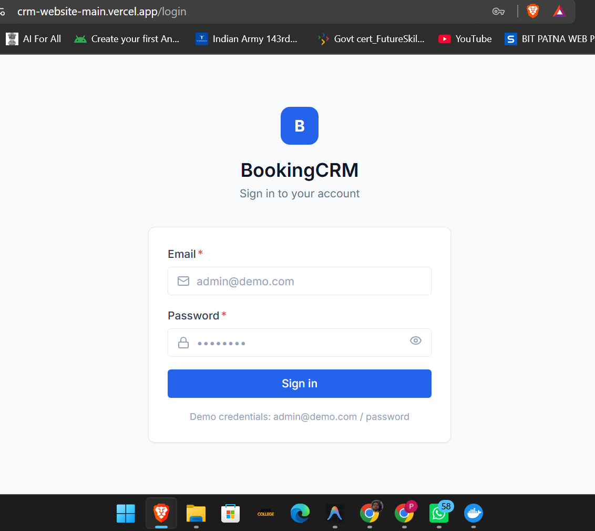
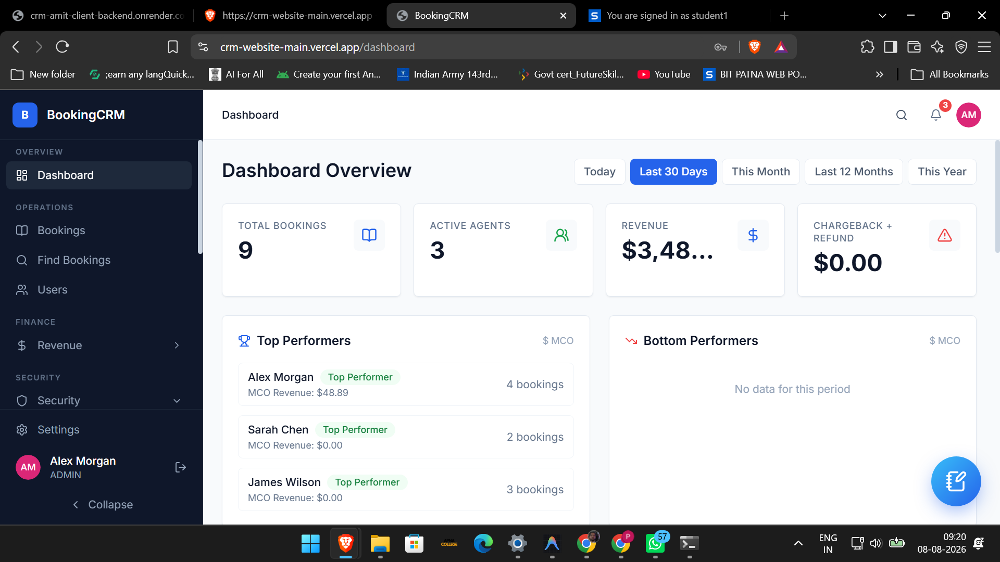
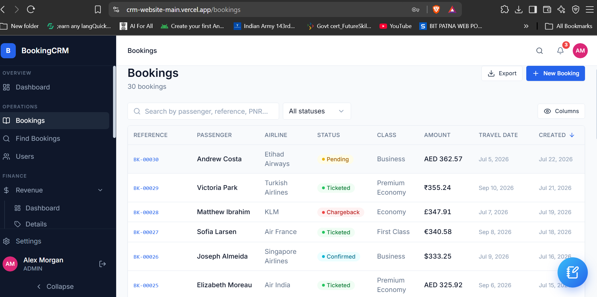
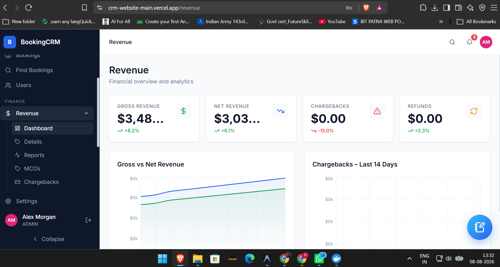
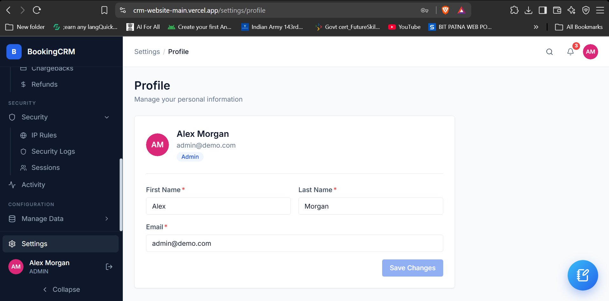
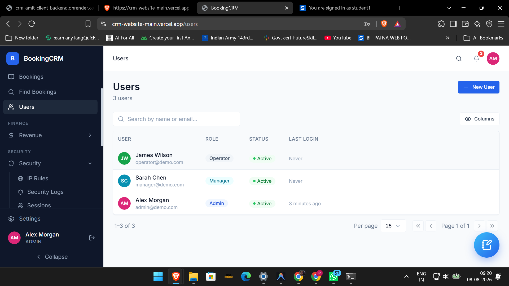
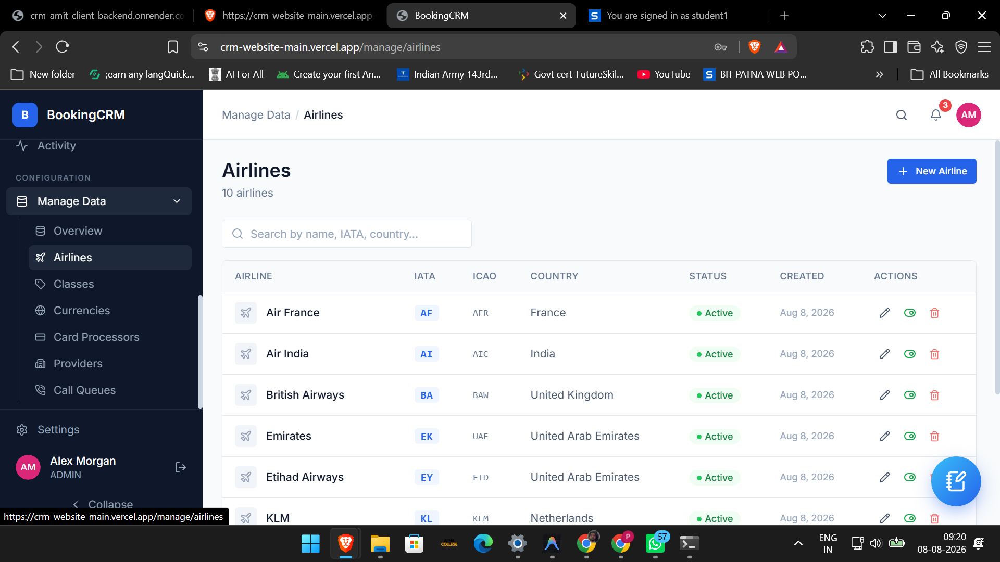
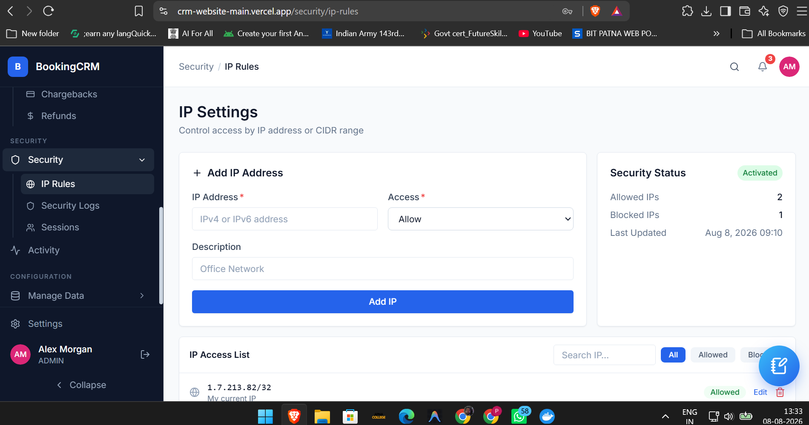

# BookingCRM — Full Stack

A production-ready full-stack Booking CRM application for managing bookings, revenue, users, airlines, notifications, security rules, activity logs, and related CRM operations.

The project is built with a React/Vite frontend, NestJS backend, Prisma ORM, and PostgreSQL.

---

## 🌐 Live Deployment

| Component | Platform | Status | URL |
|---|---|---|---|
| **Frontend** | Vercel | 🟢 Live | https://crm-website-main.vercel.app |
| **Backend API** | Render | 🟢 Live | https://crm-amit-client-backend.onrender.com |
| **Database** | Neon PostgreSQL | 🟢 Connected | Managed through Neon Console |

### Production architecture

```text
User / Browser
      │
      ▼
Vercel
React + TypeScript + Vite
      │
      │ HTTPS API requests
      ▼
Render
NestJS + Prisma Backend
      │
      │ PostgreSQL
      ▼
Neon
PostgreSQL Database
```

> The frontend is deployed on Vercel, the NestJS backend is deployed on Render, and the production PostgreSQL database is hosted on Neon.

---

## 📸 Live Application Screenshots

The following screenshots are from the deployed CRM application.

### Login



### Dashboard



### Bookings



### Revenue



### Settings



### Users



### Airlines



### IP Rules / Security



---

## ✨ Features

- Secure authentication with JWT access/refresh tokens
- Role/permission-based access control
- Booking management
- Revenue dashboard and reporting
- User management
- Airline/reference-data management
- Notifications
- Activity/audit logs
- Global search
- IP allow/deny security rules
- Quick notes
- Session management
- Chargebacks and refunds
- PostgreSQL persistence through Prisma
- React Query based server-state management
- Responsive CRM dashboard
- Production deployment with Vercel + Render + Neon

---

## 🛠️ Tech Stack

### Frontend

- React 19
- TypeScript
- Vite
- React Router
- TanStack Query
- Axios
- React Hook Form

### Backend

- NestJS
- TypeScript
- Prisma ORM
- PostgreSQL
- JWT Authentication
- Passport
- bcrypt
- class-validator
- Helmet
- Rate limiting / security middleware

### Infrastructure

- **Frontend:** Vercel
- **Backend:** Render
- **Database:** Neon PostgreSQL
- **Source Control:** Git / GitHub

---

# 🚀 Local Development

## Quick Start: Two terminals

### Terminal 1 — Backend

```bash
cd crm-backend

# First time only
cp .env.example .env
npm install

# Generate Prisma Client
npm run db:generate

# Apply migrations
npm run db:migrate

# Seed demo data
npm run db:seed

# Start development server
npm run start:dev
```

Backend:

```text
http://localhost:4000
```

API base:

```text
http://localhost:4000/api/v1
```

### Terminal 2 — Frontend

```bash
cd crm-frontend

# First time only
npm install

# Start frontend
npm run dev
```

Frontend:

```text
http://localhost:3000
```

### Demo login

```text
Email: admin@demo.com
Password: password
```

> Do not use demo credentials in a real production environment.

---

# 🐳 Docker Development

Run the complete stack with Docker:

```bash
cd crm-fullstack
docker-compose up
```

After the containers start:

```bash
docker-compose exec backend npm run db:migrate
docker-compose exec backend npm run db:seed
```

Then open:

```text
http://localhost:3000
```

---

# 🧪 Frontend-only Development

For UI development without a backend/database:

```bash
cd crm-frontend
cp .env.mock .env.local
npm run dev
```

This uses mock data and does not require the backend or PostgreSQL.

---

# 🔐 Environment Variables

## Frontend — `crm-frontend/.env`

| Variable | Default | Description |
|---|---|---|
| `VITE_API_BASE_URL` | `http://localhost:4000/api/v1` | Backend API base URL |
| `VITE_USE_MOCK` | `false` | Enable mock data |

For production, `VITE_API_BASE_URL` should point to the deployed Render backend API.

Example:

```env
VITE_API_BASE_URL=https://crm-amit-client-backend.onrender.com/api/v1
```

## Backend — `crm-backend/.env`

| Variable | Required | Description |
|---|---|---|
| `DATABASE_URL` | Yes | PostgreSQL/Neon connection string |
| `ACCESS_TOKEN_SECRET` | Yes | JWT access-token signing secret |
| `REFRESH_TOKEN_SECRET` | Yes | JWT refresh-token signing secret |
| `ACCESS_TOKEN_EXPIRY` | No | Default: `15m` |
| `REFRESH_TOKEN_EXPIRY` | No | Default: `7d` |
| `CORS_ORIGINS` | No | Allowed frontend origins |

Never commit `.env` files, database credentials, JWT secrets, or other production secrets to GitHub.

---

# 🗄️ Database

The production database is PostgreSQL hosted on Neon.

Prisma is used as the ORM and schema/introspection layer.

Useful commands:

```bash
# Generate Prisma Client
npm run db:generate

# Development migrations
npm run db:migrate

# Deploy existing production migrations
npm run db:migrate:prod

# Seed database
npm run db:seed

# Reset local database and reseed
npm run db:reset

# Open Prisma Studio
npm run db:studio
```

### Production database workflow

Production database changes should use:

```bash
npx prisma migrate deploy
```

Avoid using:

```bash
npx prisma migrate dev
```

against the production database.

---

# ☁️ Production Deployment

## Frontend — Vercel

The React/Vite frontend is deployed on Vercel.

Production URL:

```text
https://crm-website-main.vercel.app
```

The frontend uses the deployed Render backend through:

```text
VITE_API_BASE_URL=https://crm-amit-client-backend.onrender.com/api/v1
```

Because the application uses React Router with browser-based routing, the Vercel deployment includes an SPA rewrite so that direct navigation and hard refreshes on routes such as `/dashboard`, `/bookings`, `/revenue`, and `/settings` continue to load the application correctly.

## Backend — Render

The NestJS backend is deployed on Render.

Production backend:

```text
https://crm-amit-client-backend.onrender.com
```

API base path:

```text
https://crm-amit-client-backend.onrender.com/api/v1
```

A typical Render build command is:

```bash
npm install --production=false && npx prisma generate && npx prisma migrate deploy && npm run build
```

Start command:

```bash
npm run start
```

The backend uses Node.js 20.x.

## Database — Neon

The production PostgreSQL database is hosted on Neon.

The backend connects to Neon through the `DATABASE_URL` environment variable configured in Render.

Database credentials should only be stored in Render environment variables and should never be committed to the repository.

---

# 🏗️ Architecture

```text
crm-frontend/
  src/
    features/          Domain pages with TanStack Query hooks
    services/          Typed Axios service functions
    hooks/             Shared React hooks
    lib/               API client, query client, utilities
    components/        UI primitives and application components

crm-backend/
  src/
    modules/           auth, users, bookings, revenue, security,
                       activity, notifications, search, manage
    common/            Global guards, interceptors, filters, pipes
    shared/            Types, utilities, constants
    database/          PrismaService

  prisma/
    schema.prisma      Database schema
    seed/              Demo data seeder
```

---

# 🔄 Data Flow

```text
User action
    ↓
React event handler / form
    ↓
TanStack Query
    ↓
Frontend service function
    ↓
Axios API client
    ↓
NestJS Controller
    ↓
Authentication / Authorization
    ↓
NestJS Service
    ↓
Prisma
    ↓
Neon PostgreSQL
    ↓
API response
    ↓
TanStack Query cache
    ↓
React UI
```

---

# 🔌 API Endpoints

All API routes are under:

```text
/api/v1/
```

| Method | Route | Description |
|---|---|---|
| `POST` | `/auth/login` | Login and receive access/refresh authentication |
| `POST` | `/auth/refresh` | Refresh authentication tokens |
| `GET` | `/bookings` | Paginated booking list with filters |
| `POST` | `/bookings` | Create booking |
| `GET` | `/revenue/dashboard` | Revenue totals and chart data |
| `GET` | `/activity` | Cursor-paginated activity/audit trail |
| `GET` | `/search/global?q=` | Global search |
| `GET` | `/manage/airlines` | Airline/reference data |
| `GET` | `/notifications` | User notifications |
| `GET` | `/security/ip-rules` | IP allow/deny rules |

---

# 📁 Project Structure

```text
BookingCRM/
├── crm-frontend/
│   ├── src/
│   ├── public/
│   ├── package.json
│   └── vite.config.ts
│
├── crm-backend/
│   ├── src/
│   ├── prisma/
│   │   ├── schema.prisma
│   │   └── seed/
│   ├── package.json
│   └── tsconfig.json
│
├── docs/
│   └── screenshots/
│       ├── login.png
│       ├── dashboard.png
│       ├── bookings.png
│       ├── revenue.png
│       ├── settings.png
│       ├── users.png
│       ├── airlines.png
│       └── iprules.png
│
└── README.md
```

---

# 🧑‍💻 Development Scripts

### Backend

```bash
npm run build
npm run start
npm run start:dev

npm run db:generate
npm run db:migrate
npm run db:migrate:prod
npm run db:seed
npm run db:studio
npm run db:reset

npm test
npm run test:cov
npm run lint
```

### Frontend

```bash
npm run dev
npm run build
npm run preview
```

---

# 🔒 Production Security Notes

Before using this application with real customer/business data:

- Use strong, unique JWT secrets.
- Keep all production secrets in Render/Vercel environment variables.
- Do not commit `.env` files.
- Restrict CORS to trusted frontend origins.
- Configure production IP rules carefully.
- Use HTTPS for all production traffic.
- Keep dependencies updated.
- Run database migrations through the production migration workflow.
- Do not use demo credentials in production.
- Review and monitor authentication, activity logs, and security logs.
- Back up the production PostgreSQL database according to the required recovery policy.

---

## 📄 License

Add the project's license here if/when the repository is published under a specific license.
